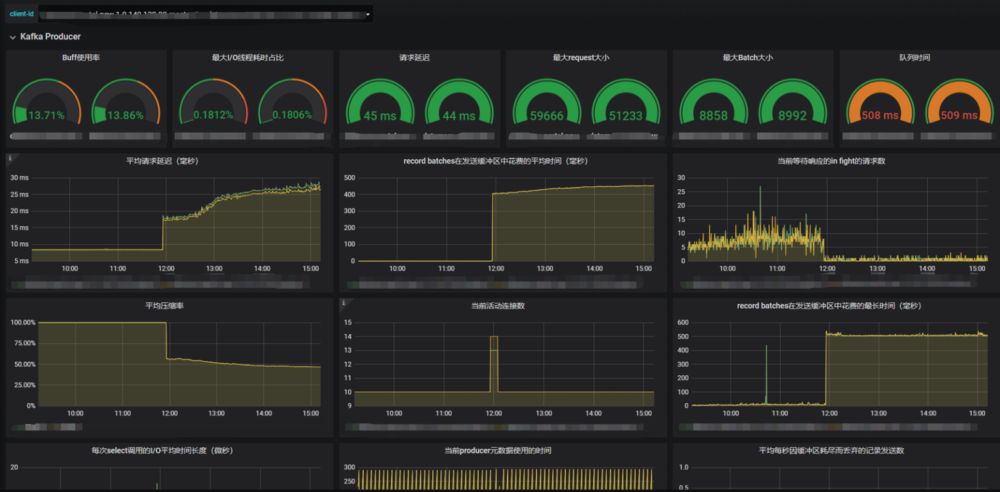
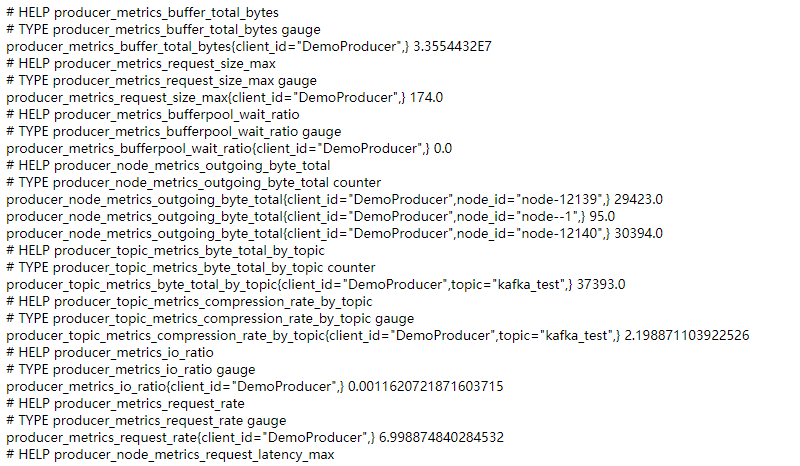
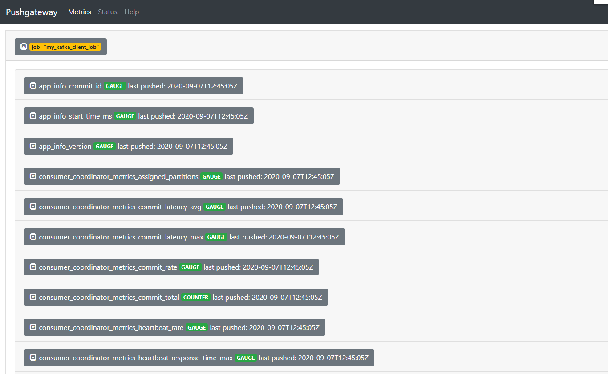

# Kafka客户端Prometheus collector

> 仅支持kafka官方提供的java版本的client

[TOC]

## 一、效果图
### 1.1 Producer


### 1.2 Consumer
// TBD

## 二、设计方案

完成基础功能

- [x] 支持HTTP Export
- [x] 支持PushGateway(含pushService)
- [x] 支持Producer(含Dashboard)
- [X] 支持Consumer(仅支持collector)

## 三、UseCase

### 3.1 依赖
1、安装依赖
方法一: `setting.xml`增加`repo` ,目前repo还不对外开放。

方法二(推荐): 安装jar
```bash
./bin/install_jar.sh
```

2、`pom.xml`增加`dependency`
```text
<dependency>
    <groupId>cn.bear2.kafka</groupId>
    <artifactId>kafka-client-prometheus-collector</artifactId>
    <version>1.0.1</version>
</dependency>
```
根据自己项目版本增加kafka和prometheus的`dependency`
```text
<dependency>
    <groupId>io.prometheus</groupId>
    <artifactId>simpleclient</artifactId>
    <version>${io.prometheus.version}</version>
</dependency>
<dependency>
    <groupId>org.apache.kafka</groupId>
    <artifactId>kafka-clients</artifactId>
    <version>${kafka.version}</version>
</dependency>
<dependency>
    <groupId>io.prometheus</groupId>
    <artifactId>simpleclient_httpserver</artifactId>
    <version>${io.prometheus.version}</version>
</dependency>
<dependency>
    <groupId>io.prometheus</groupId>
    <artifactId>simpleclient_pushgateway</artifactId>
    <version>${io.prometheus.version}</version>
</dependency>
```

### 3.1 HTTP Export
```java
Producer<Integer,String> producer = new KafkaProducer<Integer, String>(props);
new KafkaClientMetricCollector(Collections.singletonList(producer)).register();
HTTPServer server = new HTTPServer(8033);
```
```shell script
curl http://{ip}:8033/metrics
```
-----
效果图



### 3.2 PushGateway

#### 3.2.1 使用本项目的pushService
> 参照TestKafkaConsumerMetricCollector

```java
KafkaConsumer<Integer, String> consumer1 = new KafkaConsumer<>(props);
KafkaConsumer<Integer, String> consumer2 = new KafkaConsumer<>(props);
consumer1.subscribe(Collections.singletonList("kafka_test"));
consumer2.subscribe(Collections.singletonList("kafka_test"));

List<Object> clientList = new ArrayList<>();
clientList.add(consumer1);
clientList.add(consumer2);

// pushGateway形式
new KafkaClientMetricPushService(clientList, System.getenv("pushGateWayServer"), "my_kafka_client");
```
pushService还支持指定push间隔
```java
new KafkaClientMetricPushService(clientList, System.getenv("pushGateWayServer"), "my_kafka_client",15,60);
```

#### 3.2.2 业务自定义上报线程
启动一个单独的push线程,类似`HTTP Export`
```java
Collector register = new KafkaClientMetricCollector(clientList).register();
PushGateway pg = new PushGateway("127.0.0.1:9091");
pg.push(registry, "my_kafka_client_job");
```

-----
效果图



## 四、ROADMAP
- 考虑到兼容0.9.0.1的client,使用了deprecated的api `org.apache.kafka.common.Metric.value`,后续考虑替换

## 五、参考资料
- https://docs.appdynamics.com/display/PRO45/Default+JMX+Metrics+for+Apache+Kafka+Backends
- https://github.com/prometheus/jmx_exporter/pull/413
- https://github.com/sysco-middleware/kafka-client-collector
- https://kafka.apache.org/10/javadoc/index.html?org/apache/kafka/common/Metric.html
- http://cloudurable.com/blog/kafka-tutorial-kafka-producer-advanced-java-examples/index.html
- https://yunlzheng.gitbook.io/prometheus-book/part-ii-prometheus-jin-jie/exporter/custom_exporter_with_java/client_library_java
